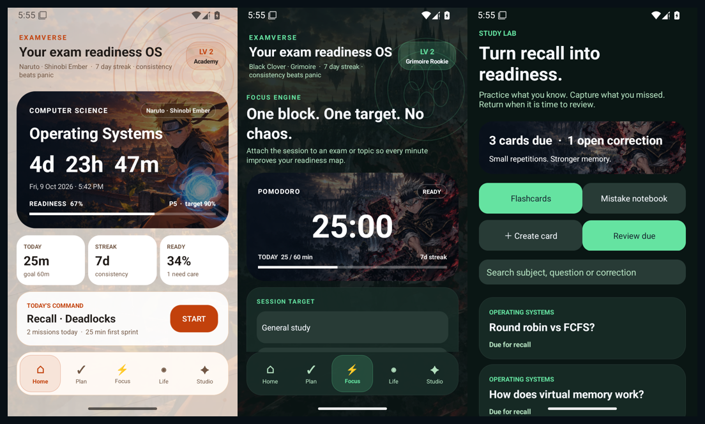

# ExamVerse v5 — Anime Study OS

An offline Android exam planner, focus companion and active-recall workspace. v5 adds illustrated anime worlds, autonomous alarm playback, widgets that adapt to small tiles, durable focus sessions and a new Study Lab.

## Download for Android

Download the installable **ExamVerse-v5.0.0.apk** from the [GitHub Releases page](https://github.com/GYASH28/exam-ready/releases). The release also contains a SHA-256 checksum. Android 8.0 or later is required.

This is a signed personal/debug build, not a Play Store release. Android requires matching signing certificates to upgrade an existing installation. Earlier GitHub Actions builds generated a fresh debug key, so an older APK may have a different certificate. Preserve your existing data before removing an old installation; do not uninstall merely to bypass a signature error without a backup.

## App preview



Screenshots use synthetic demonstration study data.

## Six illustrated worlds

Every world includes a bundled WebP scene, readable image scrims on the dashboard and focus cards, its own colors, ambient motifs, progression ranks and widget artwork:

| World | Visual direction |
| --- | --- |
| Naruto · Shinobi Ember | Naruto, Hidden Leaf sunset, Rasengan, parchment and chakra seals |
| Dragon Ball · Saiyan Energy | Original cosmic training landscape, golden energy and blue aura arcs |
| Bleach · Soul Reaper | Ichigo, moonlit rooftops, ink-black surfaces and crimson blade light |
| Black Clover · Grimoire | Asta, anti-magic sword, grimoire and emerald rune geometry |
| Demon Slayer · Water Breathing | Tanjiro, water forms, wisteria and teal flowing lines |
| One Piece · Grand Line | Luffy, sunset sails, ocean horizons and compass geometry |

Five scenes are original generated character fan art. The Dragon Ball scene uses original environment artwork rather than a character image. Source images are bundled locally: themes work offline. Ambient motion follows Android's animation-scale setting; decoded images use a bounded shared cache.

## Alarms that ring automatically

The alarm receiver starts a `mediaPlayback` foreground service. The service owns looping alarm audio, audio focus, vibration and a capped wake lock. Opening the notification is no longer required to begin playback, and leaving the ringing activity does not stop sound.

- Snooze and dismiss from the notification or lock-screen controls.
- Snooze preserves the original alarm ID and schedules ten minutes from the action, including seconds.
- Once, daily and weekday rules remain available.
- Re-schedule after reboot, app update, clock/timezone changes and exact-alarm access changes.
- Invalid custom ringtone selection falls back to the system alarm tone.
- Ringing stops after fifteen minutes if nobody dismisses it.
- Alarm Studio shows exact scheduling, notification and full-screen access, with direct Settings links and a twenty-second test.

Grant **Alarms & reminders** access for reliable background ringing. On newer Android versions, full-screen access controls whether the alarm screen opens; playback remains independent. When exact access is absent, Android can delay an approximate alarm or block a background service start; the app uses a sounding notification fallback. Alarm loudness follows the device's alarm volume and interruption settings.

The implementation follows Android's [foreground-service alarm exception](https://developer.android.com/develop/background-work/services/fgs/restrictions-bg-start) and [foreground-service launch requirements](https://developer.android.com/develop/background-work/services/fgs/launch).

## Widgets that adapt to the available space

Next Exam, Live Countdown, Upcoming Exams and Daily Mission now declare 40dp resize minima, support both resize directions and rebuild on `onAppWidgetOptionsChanged`.

- Small tiles hide secondary labels, dates and extra rows.
- Very short tiles show the essential countdown or mission value.
- Live Countdown uses an Android Chronometer in roomier layouts and a compact remaining-time value in tiny layouts.
- All six worlds are selectable independently for each widget.
- Glass opacity, glow, corner shape and density remain configurable.
- Daily Mission opens the Focus tab.
- Widget deletion removes its saved style.

The launcher decides grid dimensions and padding; 1×1 is available where the launcher permits it. Tiny static values update on the normal widget refresh or study-data changes; they do not run a permanent per-second background process. See Android's [flexible widget layout guidance](https://developer.android.com/develop/ui/views/appwidgets/layouts).

## Study Lab

- Create question/answer flashcards by subject.
- Reveal the answer before self-grading.
- **Again:** review in ten minutes. **Good:** start at one day and double the interval. **Easy:** start at three days and triple it, capped at 180 days.
- Search card prompts, answers and subjects.
- Capture mistakes with a correction and reasoning.
- Mark corrections resolved; long-press to edit, delete or turn one into a flashcard.
- Mission Control surfaces due recall cards and unresolved mistakes.

## Focus and revision improvements

- Persisted session deadline, exam/topic attribution, pause state and remaining duration.
- Session recovery after reopening the app and completion notifications while away.
- Idempotent recording prevents duplicate focus logs.
- Custom 5–180-minute focus blocks and 5/10/20-minute recovery breaks.
- Recovery breaks never add study minutes or XP.
- Manual revision missions and one-tap mission-to-focus setup.
- Difficult, low-confidence topics get earlier planning attention.
- Smart Plan considers the daily goal and existing workload; very tight deadlines can still exceed the daily target.
- Overdue tasks remain on today's board.
- Topic name, difficulty and confidence can be edited.
- Repeated completion toggles cannot farm task XP.
- Streaks expire after missed days, using calendar dates rather than fixed 24-hour day arithmetic.

Existing readiness charts, study history, syllabus management, Health Connect and optional on-device Usage Access remain available.

## Backup and privacy

Studio can export a versioned JSON file containing exams, topics, revision tasks, study history, progress, flashcards and mistake notes. Restore validates the complete file before replacing local study data. Android's document picker lets the user choose the location.

Alarms, Health Connect data, permissions, live focus state and launcher-specific widget IDs are not included in study backups. No account, backend, advertising or analytics SDK is required. Backups contain personal study information in readable JSON, so choose their storage location deliberately.

## Build and verify

Open `android/` in Android Studio or run with JDK 17, Gradle 8.11.1 and Android SDK 36:

```bash
cd android
gradle :app:assembleDebug :app:lintDebug :app:assembleDebugAndroidTest
```

APK output: `android/app/build/outputs/apk/debug/app-debug.apk`.

Device regression suite: `android/app/src/androidTest/java/com/brace/examverse/widgets/UpgradeInstrumentedTest.java`. It checks image decoding, small RemoteViews layouts, recall intervals, backup validation, focus recovery, revision planning, XP integrity and background alarm playback. Run on a clean test device with notification and exact-alarm access enabled:

```bash
gradle :app:connectedDebugAndroidTest
```

The suite intentionally clears local study/alarm test data. Do not run it against a device holding data you need to preserve. For the alarm regression, deny full-screen intent access to prove audio starts without any screen or notification interaction.

GitHub Actions compiles the APK and test APK and runs lint. It uploads an installable artifact plus checksum; the published release provides the APK as a direct download.

## Build identity

- Package: `com.brace.examverse`
- Version: `5.0.0` / version code `5`
- Minimum Android: API 26
- Target Android: API 35
- Compile SDK: API 36

Character scenes are generated fan artwork for this personal build. Franchise rights remain with their owners; public commercial distribution needs appropriate branding and artwork rights.
